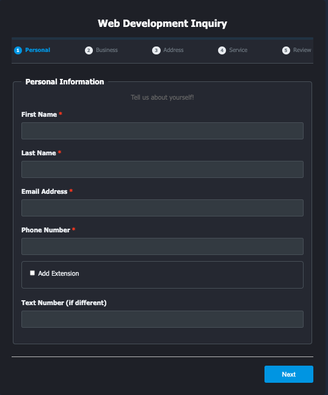
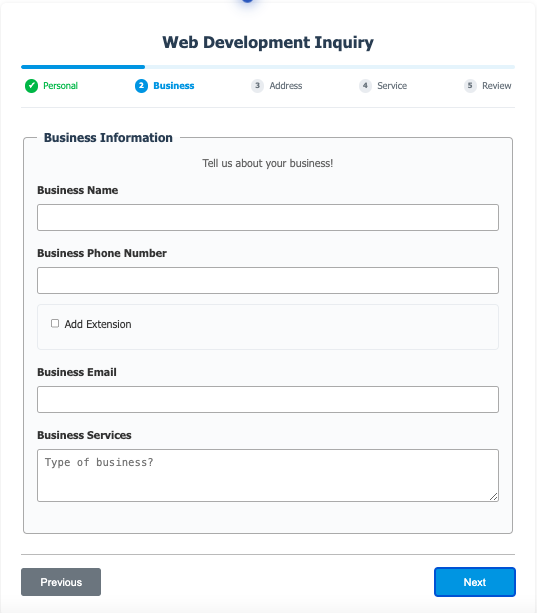
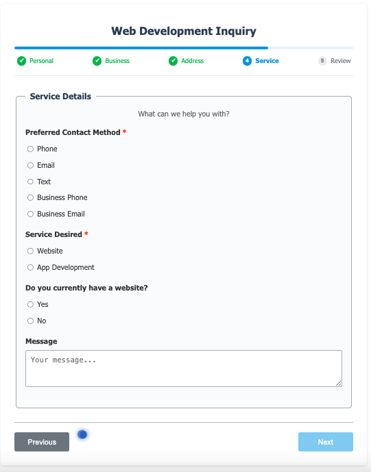

# Web Inquiry Form Web Component

A reusable web component for collecting web development inquiries from potential clients. This component encapsulates the form UI, validation logic, and submission handling into a single custom HTML element.

## Features

- **Shadow DOM Encapsulation**: Styles and DOM are isolated from the rest of the page
- **Built-in Validation**: Client-side validation for important form fields
- **Responsive Design**: Works on all device sizes
- **Phone Number Formatting**: Automatic formatting using Cleave.js
- **Conditional Fields**: Show/hide fields based on user selections
- **Customizable API Endpoint**: Specify your own API endpoint
- **Customizable Theme**: Specify "Light", "Dark", or use system preferences
- **Custom Events**: Listen for form-related events in your application
- **Toast Notifications**: Built-in feedback mechanism

## Installation

1. Download the `web-inquiry-form.js` file
2. Include it in your HTML file:

```html
<script src="path/to/web-inquiry-form.js" defer></script>
```

#### Alternatively, 

1. Import web component from github using CDN
2. Include it in your HTML file:

```html
<script src="https://rawcdn.githack.com/DevManSam777/web_inquiry_form/a23fa219013c0800a7b6ad76afb7c016189ab037/web-inquiry-form.js" defer></script>
```


## Basic Usage

Add the web component to your HTML:

```html
<web-inquiry-form></web-inquiry-form>
```

## Customization

### API Endpoint

Set a custom API endpoint for form submission:

```html
<web-inquiry-form api-url="https://your-api-endpoint.com/api/leads"></web-inquiry-form>
```

### Theme Selection

Set theme preference attribute:

```html
<web-inquiry-form theme="light" api-url="https://your-api-endpoint.com/api/leads"></web-inquiry-form>
```


_or_

```html
<web-inquiry-form theme="dark" api-url="https://your-api-endpoint.com/api/leads"></web-inquiry-form>
```


_or_

Leave blank and theme will obey user's browser preferences

### Styling

While the component uses Shadow DOM for style encapsulation, you can adjust its container width and positioning:

```css
web-inquiry-form {
  max-width: 900px;
  margin: 0 auto;
}
```

## Events

The component dispatches several custom events:

1. **form-submit**: When the form is submitted (after validation, before sending to server)
2. **form-success**: When the form is successfully submitted to the server
3. **form-error**: When there's an error submitting the form

### Event Handling Example

```javascript
// Listen for form submission data
document.addEventListener('form-submit', (event) => {
  console.log('Form data:', event.detail);
  // You can add pre-processing here
});

// Listen for successful submission
document.addEventListener('form-success', (event) => {
  console.log('Success:', event.detail.message);
  // Track conversions, redirect user, etc.
});

// Listen for errors
document.addEventListener('form-error', (event) => {
  console.error('Error:', event.detail.error);
  // Show custom error messages, log errors, etc.
});
```

## Server-Side Requirements

The component sends data to the specified API endpoint via a POST request with the following:

- Content-Type: application/json
- Request Body: JSON object containing all form fields

The server should respond with:
- 200/201 status code for success
- Error status code (4xx/5xx) with a JSON body containing a `message` property for errors

## Form Data Structure

The form submits the following data structure:

```javascript
{
  firstName: "...",
  lastName: "...",
  email: "...",
  phone: "...", // Formatted as XXX-XXX-XXXX
  phoneExt: "...", // Optional
  textNumber: "...", // Optional
  businessName: "...", // Optional
  businessPhone: "...", // Optional
  businessPhoneExt: "...", // Optional
  businessEmail: "...", // Optional
  businessServices: "...", // Optional
  billingAddress: {
    street: "...",
    aptUnit: "...", // Optional
    city: "...",
    state: "...",
    zipCode: "...",
    country: "..."
  },
  preferredContact: "phone|email|text|businessPhone|businessEmail",
  serviceDesired: "Web Development|App Development",
  hasWebsite: "yes|no", // Optional
  websiteAddress: "...", // Optional
  message: "..." // Optional
  isFormSubmission: true // Flag indicating this is from the public form
}
```

## Browser Compatibility

This component uses modern web component standards:
- Custom Elements v1
- Shadow DOM v1
- ES6+ features

Compatible with all modern browsers (Chrome, Firefox, Safari, Edge).

## Dependencies

The component dynamically loads:
- [Cleave.js](https://github.com/nosir/cleave.js) for phone number formatting

## Images








## Need a server with email notifications for your form?

Here is a link to one that I coded for you! 

https://github.com/DevManSam777/forms-server

## License

MIT