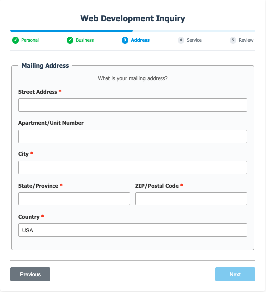

# Web Inquiry Form Web Component

A reusable web component for collecting web development inquiries from potential clients. This component encapsulates the form UI, validation logic, and submission handling into a single custom HTML element.


## Features

- **Shadow DOM Encapsulation**: Styles and DOM are isolated from the rest of the page
- **Multi-Step Form**: Guides users through a structured, multi-page inquiry process
- **Review Step**: Allows users to review all entered information before final submission
- **Built-in Validation**: Client-side validation for important form fields ensures data quality
- **Responsive Design**: Adapts seamlessly to all device sizes (mobile, tablet, desktop)
- **Phone Number Formatting**: Automatic formatting using Cleave.js for a better user experience
- **Conditional Fields**: Dynamically show or hide fields based on user selections
- **Customizable API Endpoint**: Easily specify your own backend API endpoint for form submission
- **Customizable Styling**: Extensive configuration options for colors, fonts, themes, and dimensions
- **Universal Theme Detection**: Automatically detects dark/light mode from system preferences or common website theme patterns
- **Google Fonts Integration**: Load and apply Google Fonts dynamically to match your brand
- **Custom Events**: Dispatches events for granular control and integration with your application's logic
- **Toast Notifications**: Provides built-in visual feedback for form submission success or errors

## Installation

### Option 1: Local Installation

1. Download the `web-inquiry-form.js` file
2. Include it in your HTML file:

```html
<script src="path/to/web-inquiry-form.js" defer></script>
```

### Option 2: CDN Installation

Include it directly from GitHub using CDN:

```html
<script
  src="https://raw.githack.com/DevManSam777/web_inquiry_form/main/web-inquiry-form.js"
  defer
></script>
```

## Basic Usage

Add the web component to your HTML:

```html
<web-inquiry-form></web-inquiry-form>
```

## Customization

The web-inquiry-form component is highly customizable through its attributes.

### API Endpoint

Set a custom API endpoint for form submission:

```html
<web-inquiry-form
  api-url="https://your-api-endpoint.com/api/leads"
></web-inquiry-form>
```

### Theme Selection

Control the form's theme. You can force "light" or "dark" mode, or leave it blank for automatic detection based on user's system preferences or your website's theme.

**Light Mode:**

```html
<web-inquiry-form theme="light"></web-inquiry-form>
```

**Dark Mode:**

```html
<web-inquiry-form theme="dark"></web-inquiry-form>
```

**Auto-Detection:**
Leave the theme attribute blank, and the component will automatically obey the user's browser preferences or detect common data-theme or class attributes on `<html>` or `<body>`.

### Custom Form Title

Customize the main title displayed at the top of the form:

```html
<web-inquiry-form form-title="Contact Us Today"></web-inquiry-form>
```

### Advanced Styling Example

This example demonstrates how to apply several styling attributes to match a specific aesthetic:

```html
<web-inquiry-form
  api-url="https://your-api.com/contact"
  primary-color="#6366f1"
  background-color="#ffffff"
  input-background-color="#f8fafc"
  fieldset-background-color="#f1f5f9"
  success-color="#10b981"
  error-color="#ef4444"
  border-radius="12px"
>
</web-inquiry-form>
```

### Google Fonts Integration

Easily use any Google Font by specifying its name. The component will dynamically load it and apply it to the form:

```html
<web-inquiry-form
  api-url="https://your-api.com/contact"
  google-font="Nunito Sans"
  font-size="16px"
>
</web-inquiry-form>
```

### Dark Mode Support

Configure specific colors for dark mode. These will be applied automatically when the dark theme is active:

```html
<web-inquiry-form
  api-url="https://your-api.com/contact"
  dark-primary-color="#60a5fa"
  dark-background-color="#1f2937"
  dark-text-color="#f9fafb"
  dark-input-background-color="#374151"
  dark-fieldset-background-color="#1f2937"
  dark-success-color="#4ade80"
  dark-error-color="#f87171"
  dark-progress-color="#60a5fa"
>
</web-inquiry-form>
```

## Available Attributes

These attributes allow you to deeply customize the form's appearance and behavior.

### Basic Configuration

| Attribute    | Description                                  | Default                           |
| ------------ | -------------------------------------------- | --------------------------------- |
| `api-url`    | API endpoint URL for form submission         | `http://localhost:5000/api/leads` |
| `theme`      | Force theme: "light", "dark", or auto-detect | Auto-detect                       |
| `form-title` | Custom form header text                      | "Web Development Inquiry"         |

### Layout & Typography

| Attribute       | Description                                                     | Default      |
| --------------- | --------------------------------------------------------------- | ------------ |
| `border-radius` | Corner roundness for elements                                   | `6px`        |
| `font-family`   | Custom font family (e.g., "Arial, sans-serif")                  | System fonts |
| `font-size`     | Base font size for the form (e.g., "16px")                      | `16px`       |
| `google-font`   | Name of a Google Font to load and use (e.g., "Inter", "Roboto") | None         |

### Light Mode Colors

| Attribute                   | Description                                                     | Default                  |
| --------------------------- | --------------------------------------------------------------- | ------------------------ |
| `primary-color`             | Main button and accent color                                    | `#3498db`                |
| `background-color`          | Main form container background color                            | `#ffffff`                |
| `text-color`                | General text color                                              | `#333333`                |
| `border-color`              | General border color (e.g., fieldsets, progress bar background) | `#aaaaaa`                |
| `input-background-color`    | Background color for input fields and textareas                 | Same as background-color |
| `input-text-color`          | Text color within input fields and textareas                    | Same as text-color       |
| `input-border-color`        | Border color for input fields and textareas                     | Same as border-color     |
| `fieldset-background-color` | Background color for fieldset sections                          | Same as background-color |
| `success-color`             | Color for success messages and valid input borders              | `#4caf50`                |
| `error-color`               | Color for error messages and invalid input borders              | `#d32f2f`                |
| `progress-color`            | Color for the progress bar fill and active step indicators      | Same as primary-color    |

### Dark Mode Colors

| Attribute                        | Description                            | Default                       |
| -------------------------------- | -------------------------------------- | ----------------------------- |
| `dark-primary-color`             | Primary color for dark mode            | `#60a5fa`                     |
| `dark-background-color`          | Background color for dark mode         | `#1e2026`                     |
| `dark-text-color`                | Text color for dark mode               | `#e9ecef`                     |
| `dark-border-color`              | Border color for dark mode             | `#495057`                     |
| `dark-input-background-color`    | Input field background for dark mode   | Same as dark-background-color |
| `dark-input-text-color`          | Input field text color for dark mode   | Same as dark-text-color       |
| `dark-input-border-color`        | Input field border color for dark mode | Same as dark-border-color     |
| `dark-fieldset-background-color` | Fieldset background for dark mode      | Same as dark-background-color |
| `dark-success-color`             | Success color for dark mode            | `#4ade80`                     |
| `dark-error-color`               | Error color for dark mode              | `#f87171`                     |
| `dark-progress-color`            | Progress color for dark mode           | Same as dark-primary-color    |

## Container Styling

While the component uses Shadow DOM for style encapsulation, you can adjust its container width and positioning using CSS on the web-inquiry-form element itself:

```css
web-inquiry-form {
  max-width: 900px;
  margin: 0 auto;
}
```

## Events

The component dispatches several custom events that you can listen for in your application:

- **`form-submit`**: Dispatched when the form is submitted (after client-side validation, before sending to the server)
- **`form-success`**: Dispatched when the form is successfully submitted to the server and a 2xx response is received
- **`form-error`**: Dispatched when there's an error submitting the form to the server (e.g., network error, server-side validation error)

### Event Handling Example

```javascript
// Listen for form submission data
document.addEventListener("form-submit", (event) => {
  console.log("Form data:", event.detail);
  // You can add pre-processing or custom logging here
});

// Listen for successful submission
document.addEventListener("form-success", (event) => {
  console.log("Success:", event.detail.message);
  // Example: Track conversions, display a custom success message, or redirect the user
});

// Listen for errors
document.addEventListener("form-error", (event) => {
  console.error("Error:", event.detail.error);
  // Example: Show custom error messages to the user, log errors to an analytics service
});
```

## Server-Side Requirements

The component sends data to the specified `api-url` via a POST request.

- **Content-Type**: `application/json`
- **Request Body**: A JSON object containing all form fields

The server should respond with:

- A `200` or `201` status code for successful submissions
- An error status code (e.g., `4xx` or `5xx`) with an optional JSON body containing a `message` property for errors

## Form Data Structure

The form collects and submits the following data structure. Optional fields will be included if filled out:

```javascript
{
  firstName: "...",
  lastName: "...",
  email: "...",
  phone: "...", // Formatted as XXX-XXX-XXXX
  phoneExt: "...", // Optional extension for personal phone
  textNumber: "...", // Optional text number (if different from phone)
  businessName: "...", // Optional
  businessPhone: "...", // Optional
  businessPhoneExt: "...", // Optional extension for business phone
  businessEmail: "...", // Optional
  businessServices: "...", // Optional
  billingAddress: {
    street: "...",
    aptUnit: "...", // Optional
    city: "...",
    state: "...",
    zipCode: "...",
    country: "..."
  },
  preferredContact: "phone|email|text|businessPhone|businessEmail", // Selected value
  serviceDesired: "Web Development|App Development", // Selected value
  hasWebsite: "yes|no", // Optional
  websiteAddress: "...", // Optional
  message: "...", // Optional additional comments
  isFormSubmission: true // A flag indicating this is from the public form
}
```

## Browser Compatibility

This component leverages modern web component standards:

- Custom Elements v1
- Shadow DOM v1
- ES6+ features

It is compatible with all modern browsers (Chrome, Firefox, Safari, Edge).

## Dependencies

The component dynamically loads:

- Cleave.js for phone number formatting

## Default Examples





## Custom Examples


## Related Resources

### Need a server with email notifications for your form?

Here is a link to one that I coded for you!
https://github.com/DevManSam777/forms-server

### Want a more minimal form?

https://github.com/DevManSam777/minimalist-contact-form

## License

LICENSE

Copyright (c) 2025 DevManSam
